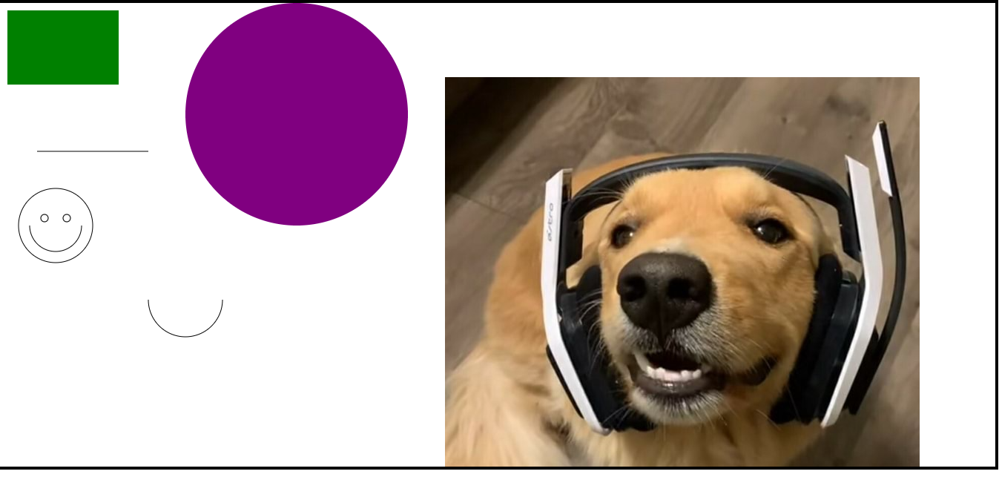

# Atividade-canvas

## HTML
Foi adicionado a estrutura básica do html com o "canvas".
Puxamos o javascript para o html.

## CSS
Foi adicionada uma borda de 4px.

## JavaScript
° Puxamos do html o elemento canvas e colocamos ele no contexto 2d;

° A variável "canvas" está sendo utilizada para criar um retângulo verde.
    -> para criação usamos: FillRect para definir o tamanho e o FillStyle para colorir.
    
° Criamos um circulo usando:
    -> beginPath para criar o objeto; O arc para definir a posição e tamanho; FillStyle para colorir e Fill para preencher.
    
° Criação da carinha: 
    -> criamos o objeto com o beginPath; Com a função arc foi usada para definir os círculos(os olhos, o rosto e a boca); MoveTo alterou as posições de cada circulo e curva;

º Para fazer uma linha: 
    -> beginPath para criar o objeto; MoveTo foi para especificar o ponto na tela ;Com o lineTo definimos a o ponto inicial e final, com o stroke desenhamos o caminho na tela.

° Arco:

    -> usa-se o arc para criar metade do círculo, entre os parênteses tem as coordenadas de x, y, raio, angulo e Math.PI; com o stroke desenhamos o arco na tela.

° colocando a imagem: 
    -> "let img=new image" é uma variável para chamar uma imagem; scr para encontrar a imagem dentro da pasta selecionada; Listener carrega a imagem na página e o drawImage um método para renderizá-lo na tela.
    
   
   
    

